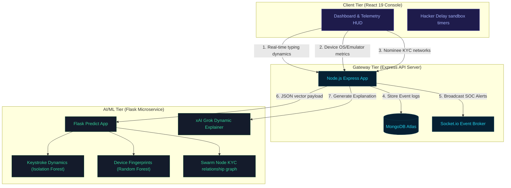
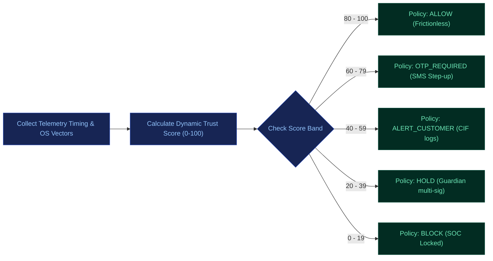

# 🛡️ Sach Ka Kavach — Bharat Trust Grid
### *Continuous Identity Trust & Adaptive Risk Interception Engine*

Designed and built for the **Bank of Baroda Hackathon 2026**, **Sach Ka Kavach** is a privacy-first, continuous risk-based Identity Trust Grid that monitors digital channels in real-time. By moving away from rigid binary logins, the engine continuously re-evaluates identity signals and locks down accounts dynamically, ensuring maximum security for vulnerable demographics with zero friction for normal users.

---

## 📌 Understanding of the Problem (Core Vulnerabilities)

Traditional banking security structures suffer from fundamental flaws:
1. **Inadequacy of Static Credentials**: Passwords and static OTPs are no longer sufficient against modern phishing, SIM swaps, and credential theft.
2. **Binary, Point-in-Time Verification**: Existing systems verify identity only once during login and do not continuously assess whether the user is still the genuine account holder.
3. **Undetected Hijacking Signals**: Account takeover attempts go unnoticed despite indicators like unusual transaction amounts, abnormal login cadences, location changes, or new device signatures.
4. **Weak KYC Onboarding Pipelines**: Fraudsters create fake, mule, or synthetic accounts by exploiting gaps in the KYC registration checks.
5. **Vulnerable Account Recovery Loops**: Suspicious account recovery requests (password resets or mobile changes) are misused to hijack profiles.
6. **Privileged Insider Misuse**: Bank employees can query customer records arbitrarily without immediate real-time authorization checks.
7. **Exploitation of Vulnerable Demographics**: Elderly, hospitalized, unconscious, or digitally less-aware customers cannot immediately recognize or respond to fraud.
8. **High Friction, Low Security**: A one-size-fits-all security approach creates unnecessary friction for genuine customers while failing to stop sophisticated fraud.

---

## ⚙️ Our Detailed Solution (The Sach Ka Kavach Engine)

Our platform addresses these vulnerabilities through a multi-dimensional approach:
* **Continuous Dynamic Risk Scoring Engine**: Calculates real-time trust scores (0–100) based on keyboard biometrics, hardware fingerprinting, impossible geo-speed session hops, relationship clustering (Aadhaar & PAN networks), password reset triggers, and privilege lookup parameters. Critically, it incorporates human and situational safety variables to protect accounts belonging to vulnerable, unconscious, or hospitalized demographics.
* **Adaptive Interception Policies**: Instead of absolute locks, step-up verification metrics (OTP verification, Customer ID checks, trusted family Guardian authorizations, and automated mathematical sandbox delays) are triggered only when threat parameters exceed predefined thresholds.

---

## 📊 System Architecture & Data Flow

---

## 🔄 Dynamic Risk Interception Flow

---

## 🛠️ Technology Stack

| Layer | Component | Description |
| :--- | :--- | :--- |
| **Frontend** | React 19, TypeScript, Tailwind CSS, Vite | Fully responsive dashboard layout, motion micro-interactions, Recharts analytics, global notification toasts. |
| **Backend API** | Node.js, Express, Socket.io | Core database controllers, event pipelines, and real-time Socket notifications. |
| **Database** | MongoDB Atlas, Mongoose | Persistent storage for users, transactions, audit logs, and employee tickets. |
| **Machine Learning** | Python, Flask, Scikit-Learn | Real-time prediction microservice (Isolation Forest, Random Forest). |
| **AI Explanation** | xAI Grok API, Groq Llama 3.3 | Real-time generation of human-readable risk summaries & action justifications. |

---

## 👥 The Development Team — Sach Ka Kavach

* **Chitra Saini** (Team Leader) 
  * **Role**: Frontend Architecture & Onboarding UX
  * **Gmail**: [chitrasaini.dev@gmail.com](mailto:chitrasaini.dev@gmail.com)
  
* **Abhyuday Jain** 
  * **Role**: Backend Services & Escrow Security Pipelines
  * **Gmail**: [abhyudayjain.security@gmail.com](mailto:abhyudayjain.security@gmail.com)
  
* **Hardik Mathur** 
  * **Role**: Machine Learning Models & System Integrations
  * **Gmail**: [hardikmathur11@gmail.com](mailto:hardikmathur11@gmail.com)
  
* **Siddharth Raut** 
  * **Role**: Risk Algorithms & Threat Overwatch Workflows
  * **Gmail**: [siddharthraut.risk@gmail.com](mailto:siddharthraut.risk@gmail.com)

---

## 🌐 Active Deployments

* **Production Frontend**: [https://sach-kavach-grid.vercel.app](https://sach-kavach-grid.vercel.app)
* **Production API Backend**: [https://sach-ka-kavach.onrender.com](https://sach-ka-kavach.onrender.com)
* **Production ML Service**: [https://sach-kavach-ml-service.onrender.com](https://sach-kavach-ml-service.onrender.com) (Health endpoint at `/health`)
